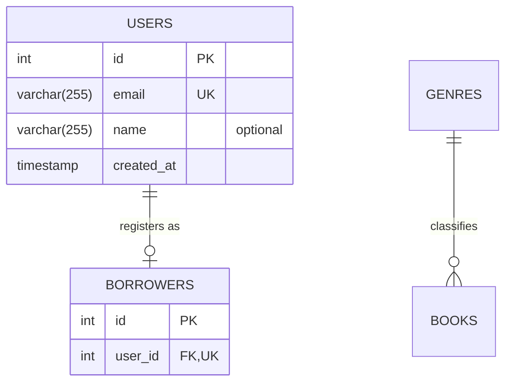

# ERD Generator

Turn a domain description into a validated Mermaid `erDiagram`, then compile it to SVG.
Never report success until the render script prints `SUCCESS`.

## Files

| Path | Role |
|---|---|
| `docs/architecture/schema.mmd` | The Mermaid source you write (overwrite it) |
| `docs/architecture/erd.svg` | Compiled diagram, produced only by the script |
| `.agent/skills/erd-generator/scripts/render_erd.js` | Validator and compiler (wraps `npx mmdc`) |

## Execution workflow

### Step 1: Parse the requirements

Before writing any Mermaid, list for yourself:

1. **Entities**: every noun that needs its own table. Name them in `UPPER_SNAKE_CASE`, plural (`USERS`, `BOOK_AUTHORS`).
2. **Primary keys (PK)**: every entity gets `int id PK` unless the user asks for UUIDs (`uuid id PK`). Junction tables use the two FK columns together as the PK.
3. **Foreign keys (FK)**: one column per relationship on the "many" side (or on the dependent side of a one-to-one), named `<singular_parent>_id`, typed to match the parent PK (`int` for `int id`, `uuid` for `uuid id`).
4. **Cardinalities**: decide one-to-one, one-to-many, or many-to-many for each pair. A many-to-many relationship always becomes a junction entity with two one-to-many relationships.
5. **Existing tables**: if the user says a table already exists (for example `users` from `src/db/migrations/001_initial_schema.ts`), keep it in the diagram so relationships to it are visible, copy its real columns, and record it in a comment line (see below). Check `src/db/migrations/` when unsure.

If the request leaves a business rule ambiguous, choose the most conventional option and state the assumption in your final output.

### Step 2: Write the Mermaid file

Write the diagram directly to `docs/architecture/schema.mmd`. Use exactly this shape:



Syntax rules (these prevent most parse errors):

- First line is exactly `erDiagram`. No ```` ``` ```` fences inside the `.mmd` file.
- Attribute lines are `type name [keys] ["comment"]`. Keys are `PK`, `FK`, `UK`, comma separated (`int user_id FK, UK`).
- Allowed types (the migration skill maps these): `int`, `bigint`, `uuid`, `varchar(N)`, `text`, `boolean`, `date`, `timestamp`, `decimal`, `float`. Do not put a comma inside a type (write `decimal`, not `decimal(10,2)`).
- Every column is NOT NULL by default. Mark nullable columns with the comment `"optional"`. Put defaults in the comment as `"default <value>"` (for example `"default 0"`, `"default now"`); combine as `"optional, default now"`.
- Relationship labels are always double-quoted.
- Comments use `%%` on their own line.
- Entity and attribute names contain only letters, digits, and underscores.

Relationship cardinality cheat sheet:

| Meaning | Mermaid | Used for |
|---|---|---|
| exactly one to zero or many | `PARENT ||--o{ CHILD : "label"` | one-to-many |
| exactly one to zero or one | `PARENT ||--o| CHILD : "label"` | one-to-one (FK gets `UK`) |
| exactly one to one or many | `PARENT ||--|{ CHILD : "label"` | one-to-many, child required |

The parent (left side) is always the table the FK points to.

### Step 3: Validate and render

From the repository root, run:

```bash
node .agent/skills/erd-generator/scripts/render_erd.js docs/architecture/schema.mmd
```

(The assignment shorthand `node scripts/render_erd.js docs/architecture/schema.mmd` refers to this same script, run from inside the skill folder. Either works.)

- Prints `SUCCESS` and exits 0: `docs/architecture/erd.svg` was written. Go to Step 5.
- Prints `SYNTAX_ERROR: ...` and exits 1: go to Step 4.

### Step 4: Self-correction loop (up to 3 retries)

When the script prints `SYNTAX_ERROR`:

1. Read the `Parse error on line N` line and the caret (`^`) under the offending token. Line numbers count from `erDiagram` as line 1.
2. Open `docs/architecture/schema.mmd`, find that line, and fix only what the error points at. Common causes:
   - `got 'NEWLINE'` after a relationship: missing quoted label after `:`.
   - `got '('` or `got ','` inside an entity: a type with a comma or unsupported characters. Simplify the type.
   - `Expecting ... got '?'` or other symbols: illegal characters in an entity or attribute name.
   - Unclosed `{` block or a stray ```` ``` ```` fence.
3. Save the file and re-run the Step 3 command.
4. Repeat at most 3 times. After the third failed retry, stop and show the user the last error and the current file contents instead of guessing further.

Keep a short log of each retry (error seen, change made) to include in the final output.

### Step 5: Final output

Reply to the user with:

1. The full contents of `docs/architecture/schema.mmd` in a ```` ```mermaid ```` code block.
2. The rendered asset path: `docs/architecture/erd.svg`.
3. A short list of the business rules and assumptions encoded in the diagram.
4. The retry log, if any retries happened.

## Guardrails

- Do not hand-write or edit `erd.svg`. Only the script produces it.
- Do not create migrations here. Generating Kysely code is the job of the `kysely-migration-generator` skill.
- Do not change existing migrations or tables. Represent existing tables as they are.
